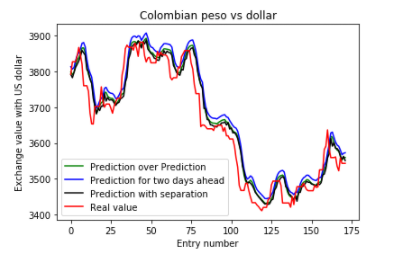
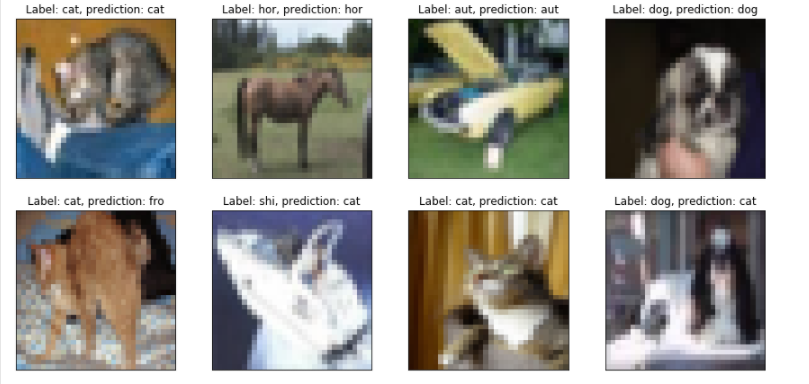
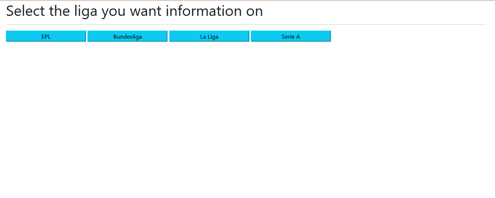
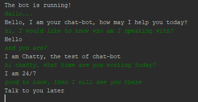
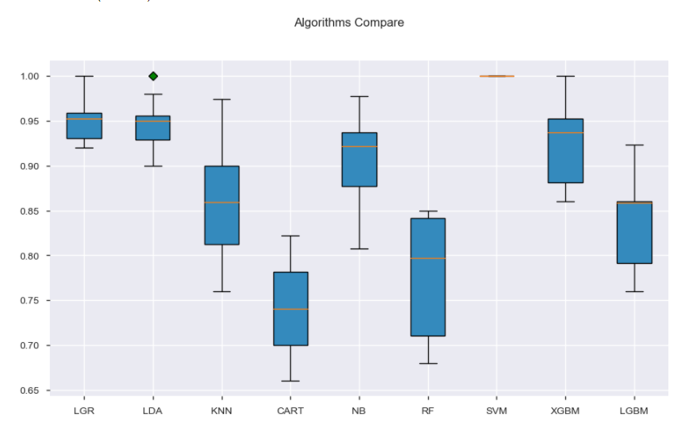

# My projects
This is the summary of the contents of my public repositories with the links to find them in my profile.

## 1. [Currency Forecast](https://github.com/mihjovil/currencyForecast)
This project consists of a currency rate exchange forecaster. Useful for me as a Colombian traveling to the US. The ides of this project was to create a Deep Learning model that would give me the most accurate prediction of the TRM up to one week in advance. Obviously the further ahead in time the most innacurate it becomes. However, it gives very acceptable results taking the scale in which the US dollar affect the Colombian Peso.

## 2. [Text processor](https://github.com/mihjovil/text_processor)
This project is a package I made for my NLP projects. It consist basically of a wrapper around spacy to handle text processing operations that I use often in different projects. It can be installed in any python environemnt using pip and it is quite useful for NLP tasks like Topic modelling and entity classification.
## 3. [DL workshop](https://github.com/mihjovil/dl_workshop)
This project consists of a jupyter file that contains an introduction to DL projects in jupyter. I created this in order to explain to some colleagues the basics of Python, Tensorflow and Jupyter. Also I cover topics like numpy and pandas. In the end I give a basic introduction to the most commons applications of Neural Networks.

## 4. [Football Results Downloader](https://github.com/mihjovil/api-football-client)
This project is driven by my passion for football. The idea is to make a fully functional score recommender. The current state of the project allows anyone to donwload a custome file that I create using <a href="https://dashboard.api-football.com/">api-football's API</a>. This contains for my favorite leagues, the scores of the season as well as the positions' table. I will add visualization tools for this data in the future and then I will tackle the score recommender model using the same data. The deployment is currently in Heroku and you can use it <a href="https://football-results-downloader.herokuapp.com/">here</a>.

## 5. [Chatbot](https://github.com/mihjovil/chatbot)
This project consist of a python application that creates a chatbot to interact with through the console. Using the JSON file you can add any type of category to interact with the chatbot and also specify what answer you wish the chatbot to return. The DL model used for this chatbot can be easily improved given that so far I have not done any hyper-parameter optimization.

## 6. [Credit Risk Project](https://github.com/mihjovil/creditAnalysis)
This project is mainly a data exploratory analysis done on a dataset with bank information from the old days in Germany. In it I display different techniques and analysis done on the data which would make part of any Data Science project. At the end, I use different models to predict when a user is risky or not to give a credit.

